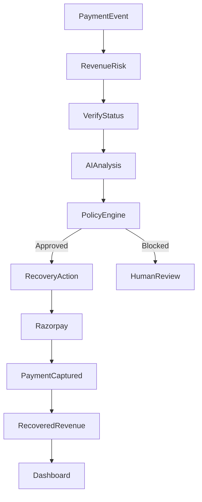

# Revive AI

Revive AI is a focused hackathon MVP for Track 03 — AI Revenue Recovery. It turns failed payment events into prioritized recovery cases, recommends a bounded intervention, verifies payment status with Recovery Guard, and records each decision.

## What is included

- Revenue-at-risk dashboard and recovery queue
- Deterministic seeded AI decision output (intent, probability, confidence, risk, and recommendation)
- Policy gate before any recovery action
- Recovery Guard late-capture demo: Ananya's case blocks because its latest status is already `CAPTURED`
- Mock payment-link creation and customer-payment simulation
- Audit trail for detection, analysis, policy, blocking, and capture
- Responsive fintech dashboard UI
- Recovery Guard safety center with blocked-state visualization
- Human approval center with approve/reject actions
- Transactions table with search and drill-in navigation
- Analytics, notifications, command bar, and demo reset controls

The demo is intentionally mocked so it is reliable without credentials. The Razorpay test-mode variables in `.env.example` are reserved for wiring a server-side integration when credentials are available; never expose the secret in browser code.

## Run

```bash
npm install
npm run dev:all
```

Open `http://localhost:5173`. `dev:all` starts both Vite and the Node API. If you prefer separate terminals, run `npm run server` and `npm run dev`.

The API is available at `http://localhost:3001/api`. It stores demo state in memory and exposes cases, audit events, analysis, policy checks, payment-link execution, simulated capture, and reset endpoints. Restarting the API resets the demo.

For the critical demo, open Rahul Mehta, run AI analysis, run policy check, execute recovery, and simulate customer payment. Then open Ananya Sharma and run the same flow to see Recovery Guard block the action.

## Architecture



## Safety

AI recommends; policy decides; Razorpay executes. The UI requires analysis and policy approval before execution, and Recovery Guard verifies the latest state before allowing a recovery action. No financial action is executed directly by the AI model.
